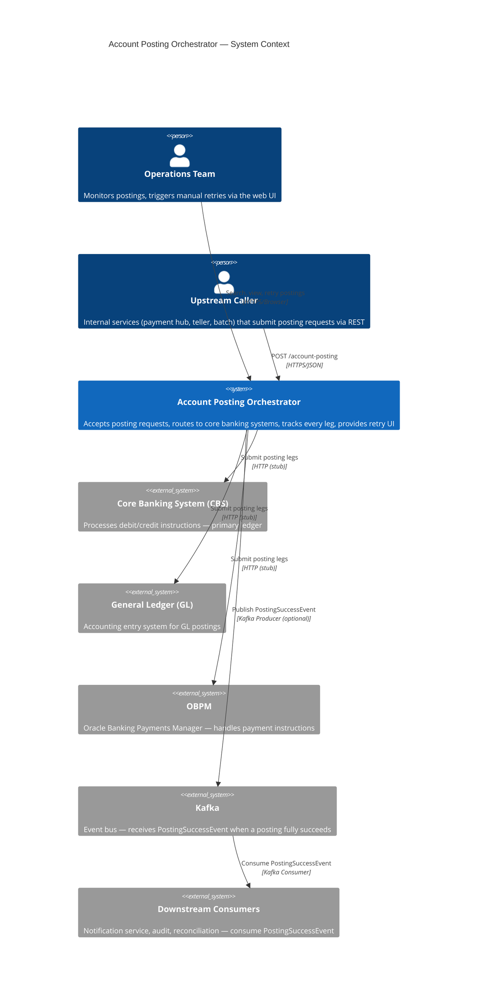
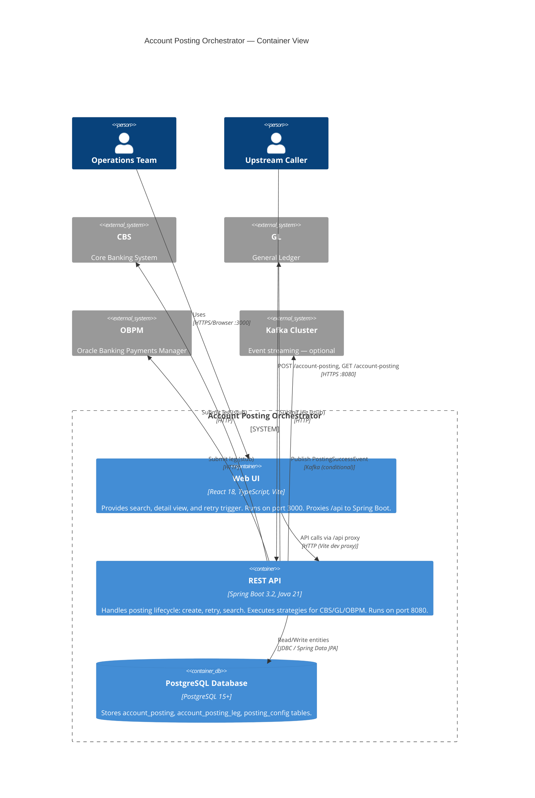

# System Architecture

This document presents the Account Posting Orchestrator at two levels of abstraction using the C4 model.

---

## C4 Level 1 — Context Diagram

Shows the system as a single black box and its relationships with external actors and systems.

---

## C4 Level 2 — Container Diagram

Zooms into the Account Posting Orchestrator boundary showing all deployable units and their interactions.

---

## Notes

- **Vite proxy**: In development, the Vite dev server proxies all `/api` requests to `http://localhost:8080`, eliminating CORS issues.
- **Kafka conditional**: The `PostingEventPublisher` bean is only registered when `kafka.enabled=true`. When disabled, no Kafka dependency is required at runtime.
- **External system stubs**: CBS, GL, and OBPM clients are currently stubs (`CoreBankingClient` / strategy impls). Replace with real HTTP clients for production.
- **Single JVM**: The `posting` and `leg` packages both run inside the Spring Boot JVM and communicate via direct Java method calls — no inter-service HTTP.
