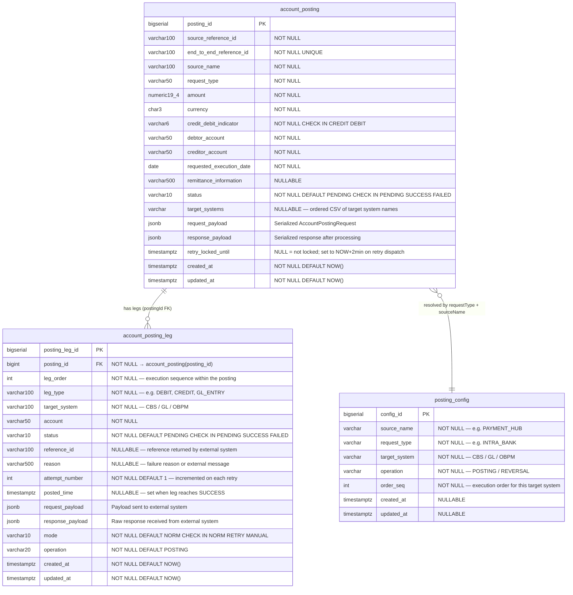

# Database Design

Full entity-relationship diagram for the Account Posting Orchestrator database. The schema uses PostgreSQL and is
managed via Flyway migrations in the `db/` module.

---

## Entity-Relationship Diagram

---

## Schema Notes

### account_posting

| Column                    | Purpose                                                                                                                                                                       |
|---------------------------|-------------------------------------------------------------------------------------------------------------------------------------------------------------------------------|
| `end_to_end_reference_id` | **Idempotency key** — UNIQUE constraint prevents duplicate submissions                                                                                                        |
| `status`                  | Aggregate status. `PENDING` = at least one leg not yet successful. `SUCCESS` = all legs succeeded. `FAILED` = reserved for hard failures (not currently used in normal flow). |
| `target_systems`          | Comma-separated ordered list of target systems derived from `posting_config` at create time — stored for auditability                                                         |
| `request_payload`         | Full original request serialized as JSONB — used by retry to reconstruct the `AccountPostingRequest`                                                                          |
| `response_payload`        | Aggregated response from all strategy executions                                                                                                                              |
| `retry_locked_until`      | Optimistic retry lock. A posting whose `retry_locked_until > NOW()` is currently being retried by another thread and is skipped by new retry requests                         |

### account_posting_leg

| Column           | Purpose                                                                                                       |
|------------------|---------------------------------------------------------------------------------------------------------------|
| `leg_order`      | Determines the execution sequence within a posting. Strategies execute sequentially in ascending `leg_order`. |
| `target_system`  | Identifies which strategy (`CBSPostingService`, `GLPostingService`, `OBPMPostingService`) handles this leg    |
| `mode`           | `NORM` = original submission; `RETRY` = retry execution; `MANUAL` = manually triggered                        |
| `attempt_number` | Incremented on each retry cycle — useful for auditing how many attempts were made                             |
| `posted_time`    | Timestamp set when the leg transitions to `SUCCESS`                                                           |

### posting_config

| Column                                 | Purpose                                                               |
|----------------------------------------|-----------------------------------------------------------------------|
| `source_name` + `request_type`         | Together identify the configuration entry for a given posting request |
| `target_system`                        | One row per target system per request type                            |
| `order_seq`                            | Determines execution order of strategies. Lower = executed first.     |
| UNIQUE `(request_type, target_system)` | Prevents duplicate configuration rows                                 |

### Relationships

- `account_posting` **1 → many** `account_posting_leg` via `posting_id` FK. The relationship is intentionally **not**
  modelled as a JPA `@ManyToOne` in the `leg` package — `postingId` is a plain `Long` column to maintain package
  decoupling.
- `posting_config` is **not** a FK relationship — it is looked up at runtime by
  `PostingConfigRepository.findBySourceNameAndRequestType()` and does not appear in the entity graph.
