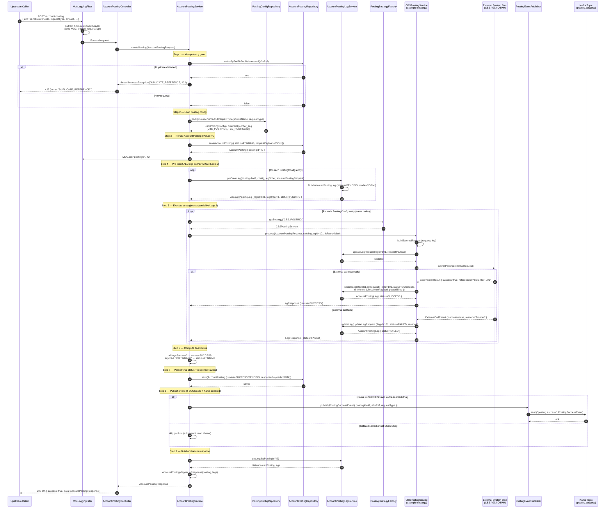

# Sequence Diagram — Create Posting Flow

Detailed end-to-end sequence for `POST /account-posting`. Shows every participant from the inbound HTTP request through strategy execution, leg updates, and optional Kafka publishing.

---

## Full Create Sequence

---

## Key Notes

| Step | Detail |
|------|--------|
| **Idempotency** | `end_to_end_reference_id` has a UNIQUE DB constraint as a second line of defence, in addition to the explicit `existsBy` check |
| **Pre-insert legs (Loop 1)** | All legs are inserted as `PENDING` before Loop 2 begins. If the first external call throws an uncaught exception, the remaining `PENDING` legs still exist in the DB and are available for retry |
| **Strategy lookup** | `PostingStrategyFactory` holds a `Map<String, PostingStrategy>` keyed by `getPostingFlow()`. No conditional logic — pure map lookup |
| **existingLegId** | Strategies receive the pre-inserted `legId` so they update the correct row rather than creating a new one |
| **Sequential execution** | Strategies execute one at a time in `order_seq` order. If a leg fails, execution continues for remaining legs (all legs are attempted) |
| **Final status logic** | `SUCCESS` only if every leg is `SUCCESS`. Any `FAILED` or still-`PENDING` leg keeps the posting in `PENDING` state so it can be retried |
| **MDC enrichment** | `postingId` and `e2eRef` are added to MDC after the posting is saved, enriching all subsequent log lines in the same thread |
