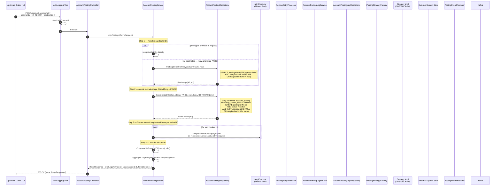
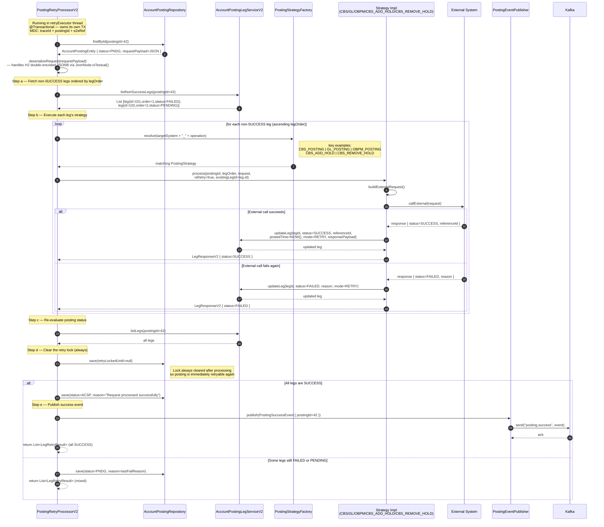
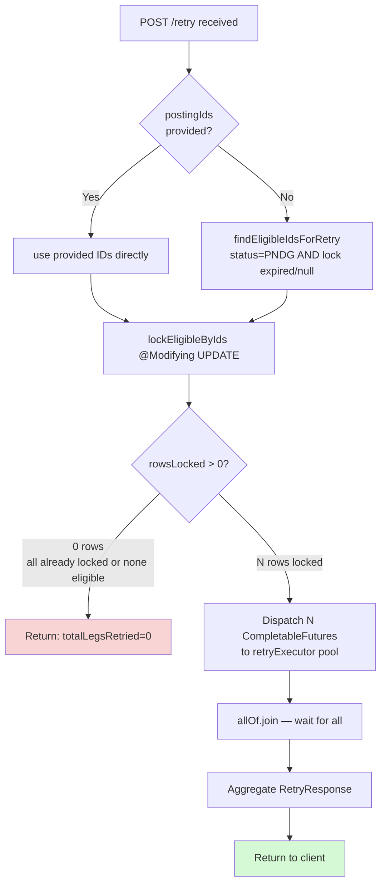

# Sequence Diagram — Retry Flow

Detailed sequence for `POST /account-posting/retry`. Highlights the atomic lock mechanism, parallel `CompletableFuture`
dispatch, and per-posting retry processing.

---

## Retry Flow — Top Level (Lock + Dispatch)

---

## Retry Flow — Per-Posting Processing (PostingRetryProcessor)

---

## Retry Lock State Diagram

---

## Key Notes

| Aspect                         | Detail                                                                                                                                                                                                                                                  |
|--------------------------------|---------------------------------------------------------------------------------------------------------------------------------------------------------------------------------------------------------------------------------------------------------|
| **Lock mechanism**             | Two JPQL steps: `findEligibleIdsForRetry` (SELECT) → `lockEligibleByIds` (@Modifying UPDATE). The UPDATE's WHERE clause re-checks `status=PNDG AND lock expired/null`, so races between concurrent callers are harmless. No DB row lock is held.        |
| **Lock cleared after retry**   | `PostingRetryProcessorV2` always sets `retry_locked_until = null` after processing, regardless of outcome. The posting is therefore immediately eligible for the next retry cycle instead of waiting 2 minutes.                                          |
| **Lock TTL fallback**          | The 2-minute TTL (`LOCK_TTL_SECONDS = 120`) protects against processor crashes. If the JVM dies mid-retry, the lock expires naturally and the posting becomes eligible again.                                                                            |
| **Strategy resolution**        | `PostingStrategyFactory.resolve(targetSystem + "_" + operation)` — e.g. `CBS_POSTING`, `GL_POSTING`, `OBPM_POSTING`, `CBS_ADD_HOLD`, `CBS_REMOVE_HOLD`. Adding a new operation requires only a new `@Service` implementing `PostingStrategy`.           |
| **Parallel execution**         | Each posting gets its own `CompletableFuture` on the `retryExecutor` thread pool (configured in `AsyncConfig`). Leg execution within a posting is still sequential (must respect `leg_order`).                                                          |
| **isRetry flag**               | Strategies receive `isRetry=true`, causing them to set `mode=RETRY` on the leg update.                                                                                                                                                                  |
| **MDC in async threads**       | Parent MDC map is captured before dispatch and restored inside each `CompletableFuture` task, since MDC is thread-local.                                                                                                                                 |
| **No leg pre-insert on retry** | Unlike the create flow, retry uses the existing `PENDING`/`FAILED` legs — it does not create new rows. It only processes legs not yet `SUCCESS`.                                                                                                        |
| **H2 JSONB compatibility**     | `deserializeRequest()` uses `JsonNode.isTextual()` to detect H2's double-encoding of JSONB columns (`columnDefinition = "jsonb"`). If the root token is a string, the inner text value is deserialized. PostgreSQL is unaffected.                       |
