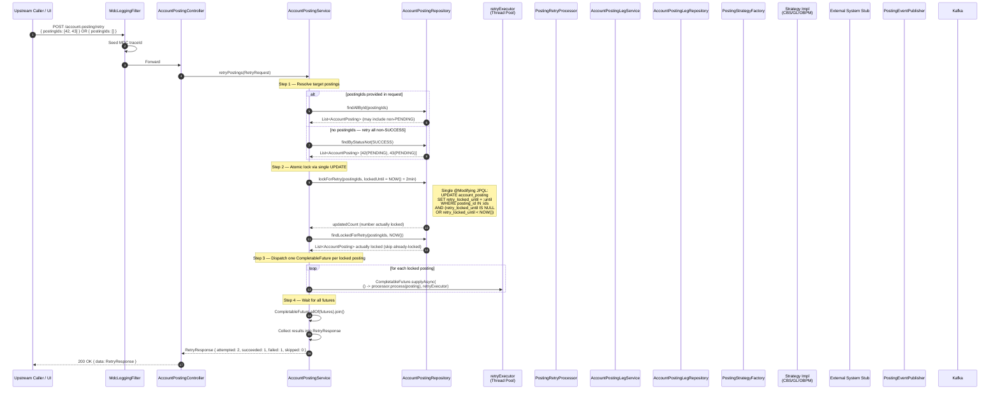
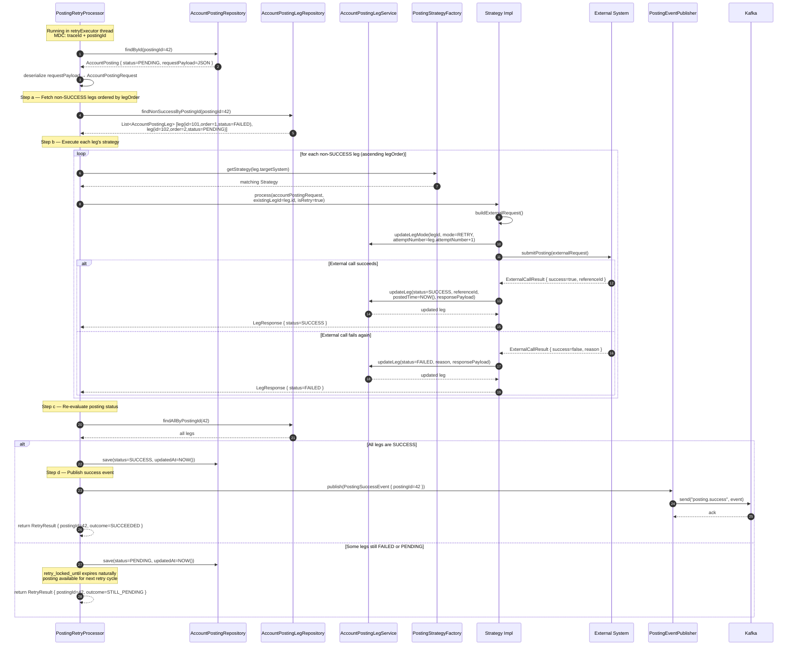
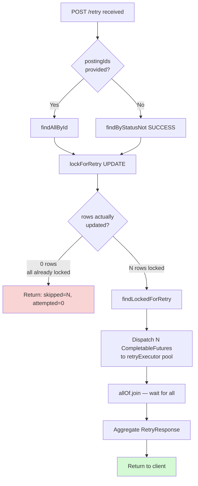

# Sequence Diagram — Retry Flow

Detailed sequence for `POST /account-posting/retry`. Highlights the atomic lock mechanism, parallel `CompletableFuture` dispatch, and per-posting retry processing.

---

## Retry Flow — Top Level (Lock + Dispatch)

---

## Retry Flow — Per-Posting Processing (PostingRetryProcessor)

---

## Retry Lock State Diagram

---

## Key Notes

| Aspect | Detail |
|--------|--------|
| **Lock mechanism** | `retry_locked_until` is set atomically in a single `UPDATE ... WHERE retry_locked_until IS NULL OR retry_locked_until < NOW()`. This prevents two concurrent retry requests from picking up the same posting. No DB row lock is held. |
| **Lock expiry** | After 2 minutes, `retry_locked_until` becomes stale and the posting is eligible for another retry cycle automatically. |
| **Parallel execution** | Each posting gets its own `CompletableFuture` on the `retryExecutor` thread pool (configured in `AsyncConfig`). Leg execution within a posting is still sequential (must respect `leg_order`). |
| **isRetry flag** | Strategies receive `isRetry=true`, allowing them to set `mode=RETRY` and increment `attempt_number` on the leg. |
| **Already-locked skip** | Postings where `retry_locked_until > NOW()` are skipped (counted in `skipped` in the response). Prevents stampede on slow retries. |
| **MDC in async threads** | `PostingRetryProcessor` re-seeds MDC with `postingId` and `e2eRef` at the start of each `CompletableFuture` task since MDC is thread-local. |
| **No leg pre-insert on retry** | Unlike create flow, retry uses the existing `PENDING`/`FAILED` legs — it does not create new rows. It only processes legs that are not yet `SUCCESS`. |
