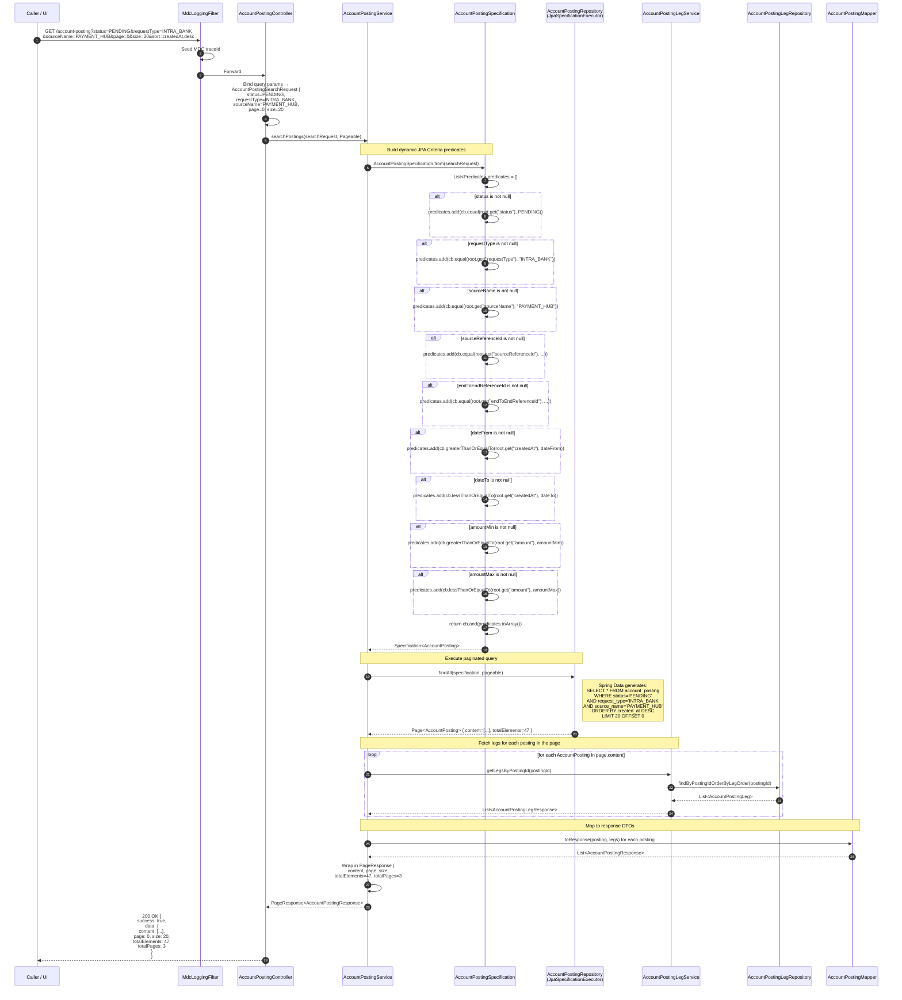
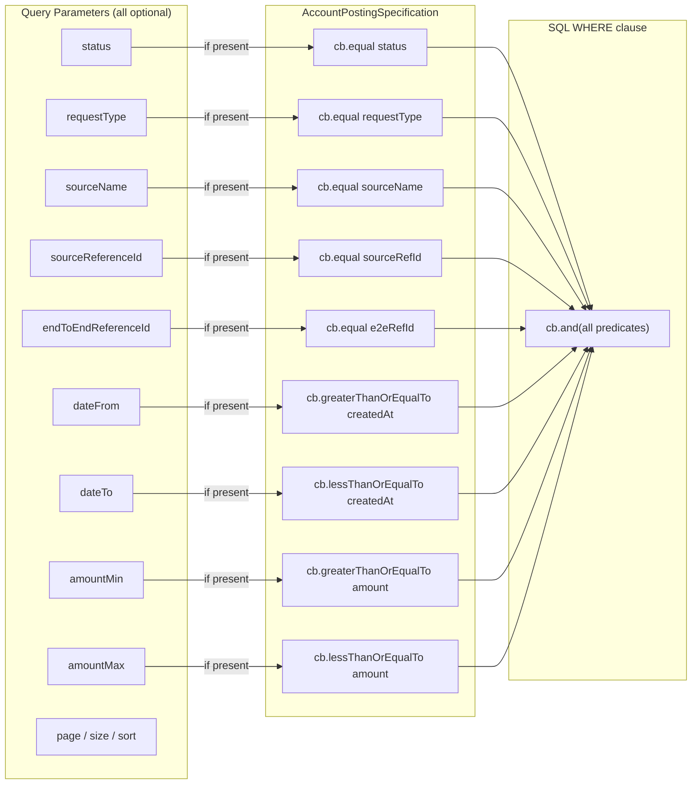

# Sequence Diagram — Search / List Postings Flow

Sequence for `GET /account-posting` with optional query parameters. Highlights the dynamic JPA Specification predicate
building and paginated response construction.

---

## Search Flow

---

## Search Parameter Reference

---

## Key Notes

| Aspect                       | Detail                                                                                                                                                                                     |
|------------------------------|--------------------------------------------------------------------------------------------------------------------------------------------------------------------------------------------|
| **Zero parameters**          | If no filter params are provided, `predicates` is empty and `cb.and()` with no args evaluates to `TRUE` — returns all postings (paginated)                                                 |
| **JpaSpecificationExecutor** | `AccountPostingRepository` extends `JpaSpecificationExecutor<AccountPosting>`, enabling `findAll(Specification, Pageable)` without writing a custom query                                  |
| **N+1 avoidance**            | Legs are fetched in a loop per posting (one query per posting in the page). For pages of 20 this is acceptable; a batch-fetch or `IN (postingIds)` query could be added as an optimisation |
| **Sorting**                  | Spring Data `Pageable` handles `sort=createdAt,desc`. Multiple sort fields are supported.                                                                                                  |
| **UI integration**           | The React `PostingListPage` sends search form values as query params and renders the paginated `PageResponse`                                                                              |
