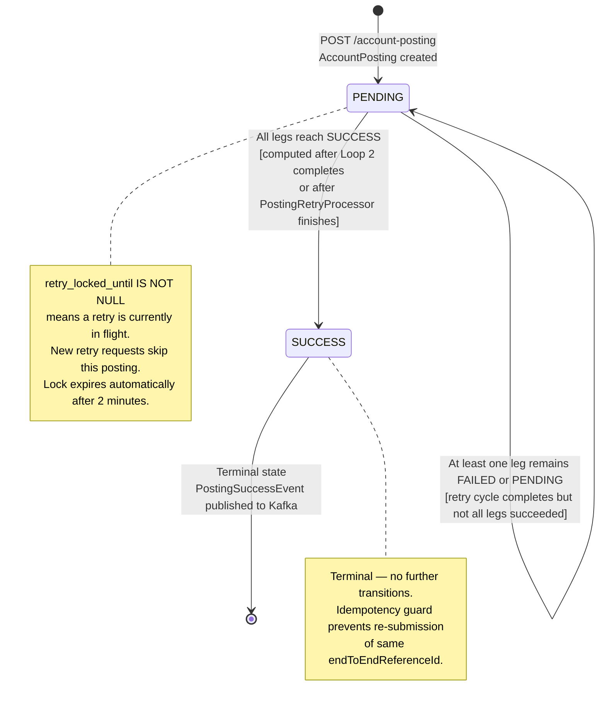
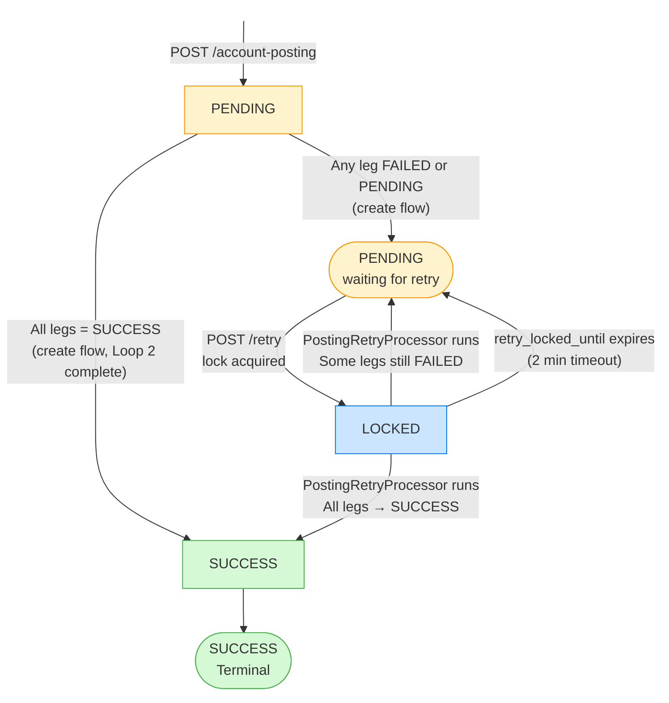
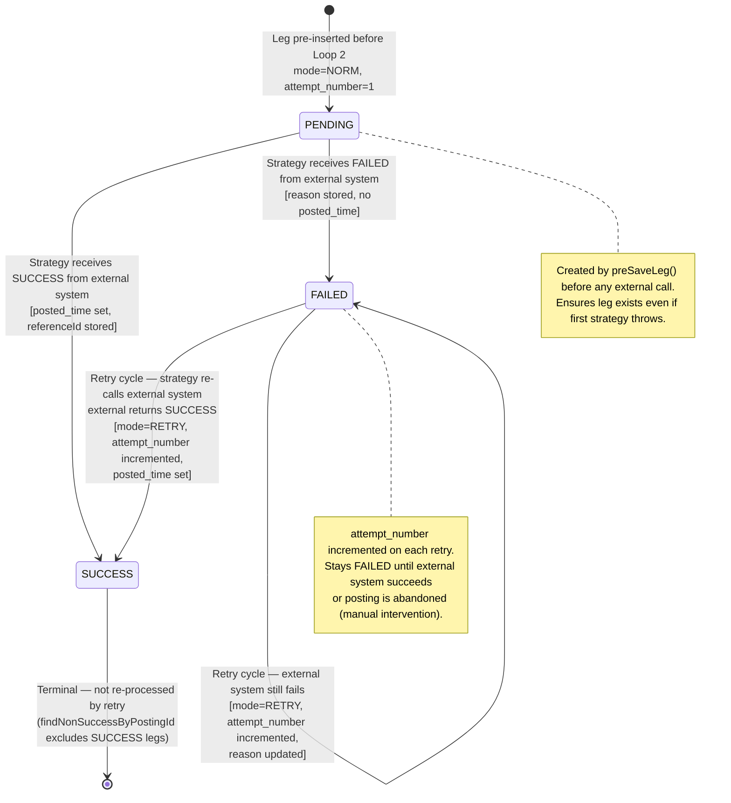
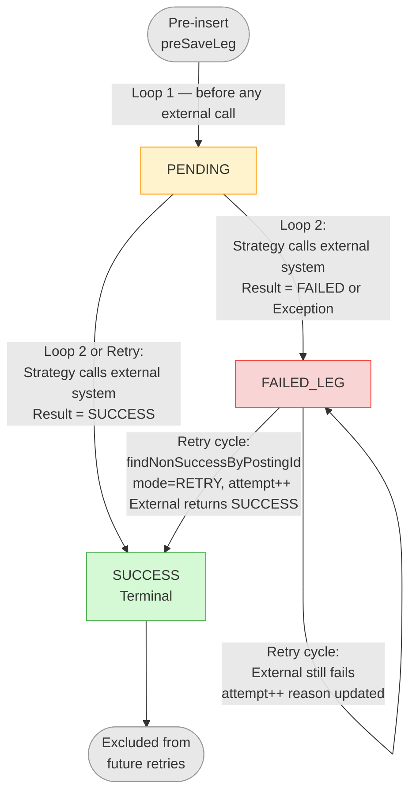
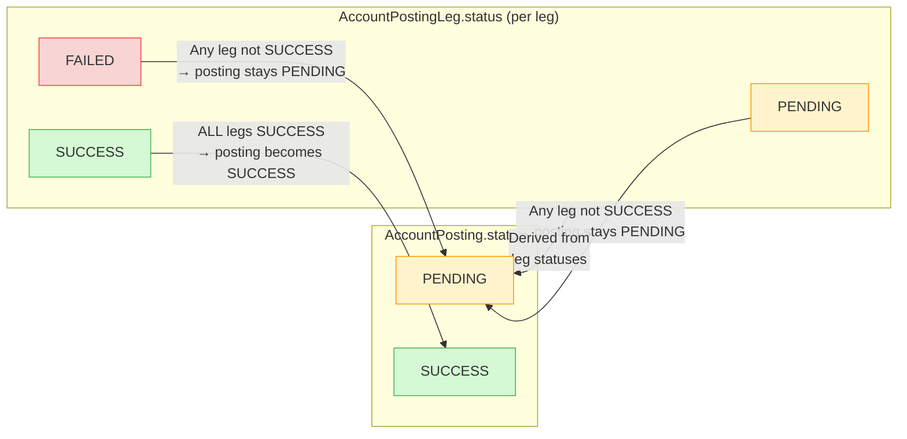

# State Machine Diagrams

Status transition diagrams for both `AccountPosting` and `AccountPostingLeg`. Each diagram shows all valid states, transition triggers, and guard conditions.

---

## Posting Status State Machine

---

## Posting Status — Extended Transition Table

---

## Leg Status State Machine

---

## Leg Status Transitions — Detailed

---

## Combined Status Relationship

---

## Key Notes

| Rule | Detail |
|------|--------|
| **Posting SUCCESS requires all legs SUCCESS** | The `AccountPostingService` checks every leg after Loop 2. If any leg is not `SUCCESS`, the posting remains `PENDING`. |
| **SUCCESS is terminal for legs** | `findNonSuccessByPostingId()` filters out `SUCCESS` legs. Once a leg succeeds it is never re-processed. |
| **No FAILED terminal for postings** | A posting never permanently transitions to `FAILED` in the normal flow — it stays `PENDING` so it can be retried. `FAILED` is reserved for use cases like manual intervention or hard-fail business rules. |
| **Retry lock is not a status** | The retry lock (`retry_locked_until`) is a timestamp column on the posting, not a distinct status value. A locked posting still shows `PENDING`. |
| **mode column tracks how a leg was last processed** | `NORM` = original create flow; `RETRY` = processed by retry; `MANUAL` = manually triggered outside normal flows. |
