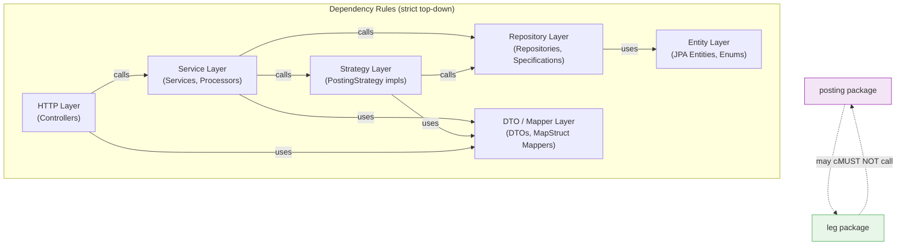

# Component Diagram — Spring Boot Internal Architecture

Shows all Spring-managed beans, their package boundaries, and dependency relationships within the Account Posting Orchestrator API.

---

## Full Component Dependency Graph

```mermaid
graph TD
    subgraph config["config package"]
        AsyncConfig["AsyncConfig\n@Configuration\nretryExecutor ThreadPool"]
        JpaConfig["JpaConfig\n@Configuration\n@EnableJpaAuditing\n@EnableJpaRepositories"]
        MdcFilter["MdcLoggingFilter\n@Component\nOncePerRequestFilter\ntraceId per request"]
    end

    subgraph common["common package"]
        GEH["GlobalExceptionHandler\n@RestControllerAdvice"]
        ApiResp["ApiResponse<T>\nGeneric envelope"]
        ApiErr["ApiError\nField-level errors"]
        BizEx["BusinessException\n→ HTTP 422"]
        ResNF["ResourceNotFoundException\n→ HTTP 404"]
    end

    subgraph posting["posting package"]
        subgraph posting_web["Web Layer"]
            PostCtrl["AccountPostingController\n@RestController\n/account-posting"]
        end

        subgraph posting_svc["Service Layer"]
            PostSvc["AccountPostingService\n(interface)"]
            PostSvcImpl["AccountPostingServiceImpl\n@Service @Transactional"]
            RetryProc["PostingRetryProcessor\n@Component\nasync processing"]
        end

        subgraph posting_repo["Repository Layer"]
            PostRepo["AccountPostingRepository\n@Repository\nextends JpaSpecificationExecutor"]
            CfgRepo["PostingConfigRepository\n@Repository"]
            PostSpec["AccountPostingSpecification\n@Component\nbuilds JPA Criteria"]
        end

        subgraph posting_entity["Entities"]
            PostEntity["AccountPosting\n@Entity"]
            PostStatus["PostingStatus\nenum: PENDING SUCCESS FAILED"]
            PostConfig["PostingConfig\n@Entity"]
        end

        subgraph posting_dto["DTOs"]
            PostReq["AccountPostingRequest"]
            PostResp["AccountPostingResponse"]
            RetryReq["RetryRequest"]
            RetryResp["RetryResponse"]
        end

        subgraph posting_mapper["Mapper"]
            PostMapper["AccountPostingMapper\n@Mapper (MapStruct)"]
        end

        subgraph strategy["Strategy Package"]
            StratIface["PostingStrategy\ninterface\ngetPostingFlow()\nprocess()"]
            StratFactory["PostingStrategyFactory\n@Component\nMap indexed by getPostingFlow()"]
            CBSSvc["CBSPostingService\n@Service"]
            GLSvc["GLPostingService\n@Service"]
            OBPMSvc["OBPMPostingService\n@Service"]
        end

        subgraph event["Event Package"]
            EventRec["PostingSuccessEvent\nrecord"]
            EventPub["PostingEventPublisher\n@Component\n@ConditionalOnProperty\nkafka.enabled=true"]
        end
    end

    subgraph leg["leg package"]
        subgraph leg_web["Web Layer"]
            LegCtrl["AccountPostingLegController\n@RestController\n/account-posting-leg"]
        end

        subgraph leg_svc["Service Layer"]
            LegSvc["AccountPostingLegService\n(interface)"]
            LegSvcImpl["AccountPostingLegServiceImpl\n@Service @Transactional"]
        end

        subgraph leg_repo["Repository Layer"]
            LegRepo["AccountPostingLegRepository\n@Repository\nfindByPostingIdOrderByLegOrder\nfindNonSuccessByPostingId\nlockForRetry @Modifying"]
        end

        subgraph leg_entity["Entities"]
            LegEntity["AccountPostingLeg\n@Entity\n@Version optimistic lock"]
            LegStatus["LegStatus\nenum: PENDING SUCCESS FAILED"]
            LegMode["LegMode\nenum: NORM RETRY MANUAL"]
        end

        subgraph leg_mapper["Mapper"]
            LegMapper["AccountPostingLegMapper\n@Mapper (MapStruct)"]
        end
    end

    subgraph external["External"]
        Kafka["Kafka\nposting.success topic"]
        CBS["CBS Stub"]
        GL["GL Stub"]
        OBPM["OBPM Stub"]
        DB[("PostgreSQL\nJDBC")]
    end

    %% Controller → Service
    PostCtrl --> PostSvc
    LegCtrl --> LegSvc

    %% Service Impl wires
    PostSvcImpl --> PostRepo
    PostSvcImpl --> CfgRepo
    PostSvcImpl --> LegSvc
    PostSvcImpl --> StratFactory
    PostSvcImpl --> RetryProc
    PostSvcImpl --> EventPub
    PostSvcImpl --> PostMapper

    %% RetryProcessor wires
    RetryProc --> PostRepo
    RetryProc --> LegRepo
    RetryProc --> LegSvc
    RetryProc --> StratFactory
    RetryProc --> EventPub
    RetryProc --> AsyncConfig

    %% Strategy wiring
    StratFactory --> CBSSvc
    StratFactory --> GLSvc
    StratFactory --> OBPMSvc
    CBSSvc --> LegSvc
    GLSvc --> LegSvc
    OBPMSvc --> LegSvc
    CBSSvc --> CBS
    GLSvc --> GL
    OBPMSvc --> OBPM

    %% Strategy implements interface
    CBSSvc -. implements .-> StratIface
    GLSvc -. implements .-> StratIface
    OBPMSvc -. implements .-> StratIface

    %% Leg service wires
    LegSvcImpl --> LegRepo
    LegSvcImpl --> LegMapper

    %% Repos → DB
    PostRepo --> DB
    CfgRepo --> DB
    LegRepo --> DB

    %% Specification used by service
    PostSvcImpl --> PostSpec

    %% Event publishing
    EventPub --> Kafka

    %% Exception handling
    GEH -. handles exceptions from .-> PostCtrl
    GEH -. handles exceptions from .-> LegCtrl

    %% MDC filter wraps all requests
    MdcFilter -. wraps .-> PostCtrl
    MdcFilter -. wraps .-> LegCtrl

    %% Mapper relationships
    PostMapper --> PostEntity
    PostMapper --> PostResp
    LegMapper --> LegEntity

    style config fill:#e8f4fd,stroke:#2196f3
    style common fill:#fce4ec,stroke:#e91e63
    style posting fill:#f3e5f5,stroke:#9c27b0
    style leg fill:#e8f5e9,stroke:#4caf50
    style external fill:#fff8e1,stroke:#ff9800
    style strategy fill:#ede7f6,stroke:#673ab7
    style event fill:#e0f2f1,stroke:#009688
```

---

## Layer Dependency Rules

---

## Key Notes

| Component | Role |
|-----------|------|
| `AccountPostingController` | Receives HTTP requests, delegates to `AccountPostingService`, returns `ApiResponse<T>` envelope |
| `AccountPostingServiceImpl` | Orchestrates the full create/retry flow. Injects `AccountPostingLegService` directly (no HTTP). |
| `PostingRetryProcessor` | Handles per-posting retry logic inside a `CompletableFuture`. Injected into `AccountPostingServiceImpl`. |
| `PostingStrategyFactory` | On startup, collects all `PostingStrategy` beans into a `Map<String, PostingStrategy>` keyed by `getPostingFlow()`. Zero switch statements. |
| `AccountPostingSpecification` | Builds `Specification<AccountPosting>` from an `AccountPostingSearchRequest`. Each field adds a predicate only if non-null. |
| `PostingEventPublisher` | Only registered as a bean when `kafka.enabled=true` (`@ConditionalOnProperty`). `AccountPostingServiceImpl` holds it as `@Autowired(required=false)` and null-guards before calling. |
| `MdcLoggingFilter` | `OncePerRequestFilter` that extracts `X-Correlation-Id` from the incoming header, generates one if absent, and puts `traceId`, `requestType`, etc. into MDC for the duration of the request. |
| **Package rule** | The `leg` package contains NO imports from the `posting` package. `posting` may freely call `leg` via the `AccountPostingLegService` interface. |
