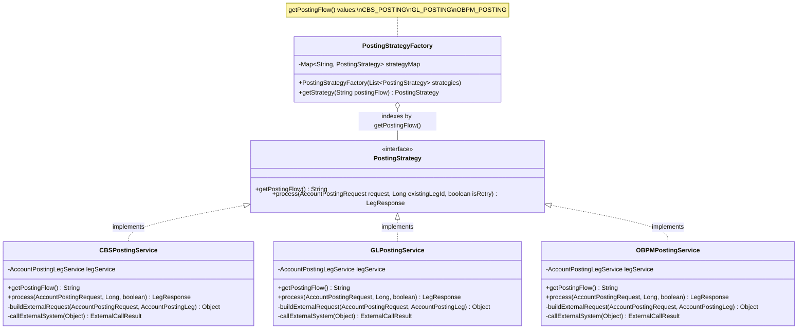
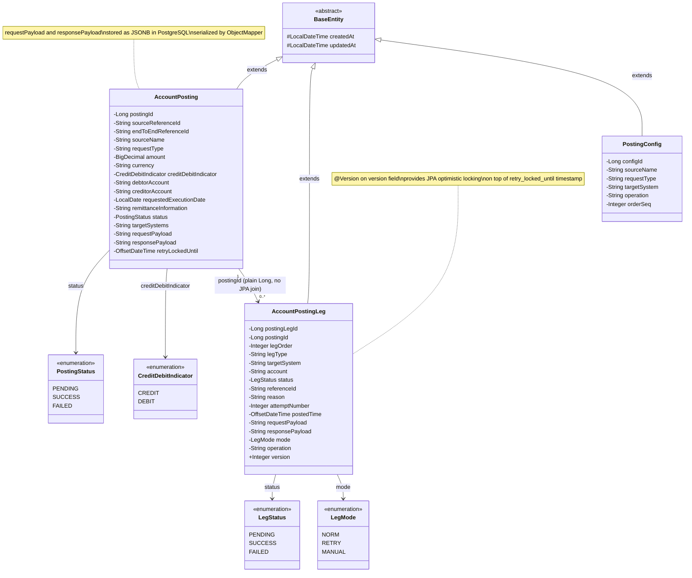
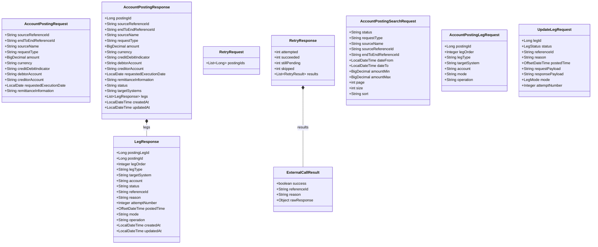
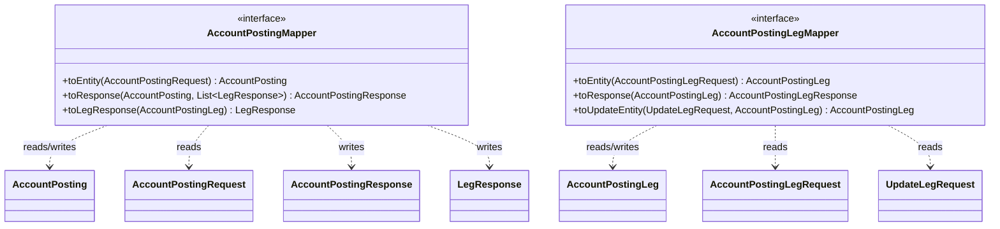

# Class Diagram

UML class diagram for the core domain model including the Strategy pattern, JPA entities, DTOs, and MapStruct mappers.

---

## Strategy Pattern

---

## Entities and Enums

---

## DTO Classes

---

## MapStruct Mappers

---

## Key Notes

| Design Decision | Rationale |
|-----------------|-----------|
| **`PostingStrategy` interface** | Enables the Factory to hold all implementations in a `Map` without any `instanceof` or switch logic. Adding a new external system requires only a new `@Service` implementing the interface. |
| **`getPostingFlow()` as map key** | Each strategy self-declares its key. `PostingStrategyFactory` collects them at application startup via `List<PostingStrategy>` injection. |
| **`AccountPostingLeg.postingId` as `Long`** | Not a JPA `@ManyToOne` — prevents the `leg` package from importing `AccountPosting`. Package boundary enforced at the JVM level. |
| **`@Version` on `AccountPostingLeg`** | Provides optimistic locking at the JPA layer. Combined with the `retry_locked_until` timestamp on the posting, gives two layers of concurrency protection. |
| **JSONB payloads on entities** | `requestPayload` and `responsePayload` are stored as plain `String` (JSONB in DB). Deserialization via `ObjectMapper` happens explicitly in `PostingRetryProcessor` when reconstructing the request for retry. |
| **MapStruct over manual mapping** | Compile-time generated mappers eliminate runtime reflection. Explicit `@Mapping` annotations make field-level transformations traceable. |
