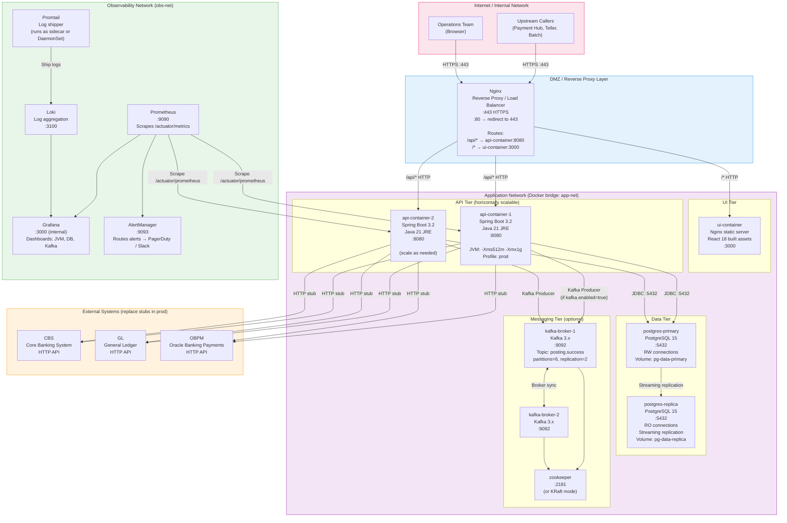
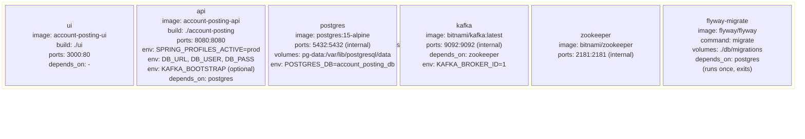

# Deployment Diagram

Production deployment topology for the Account Posting Orchestrator. Shows Docker containers, network boundaries,
redundancy, and observability infrastructure.

---

## Production Deployment Architecture

---

## Docker Compose Service Definitions

---

## Network and Port Reference

| Service            | Internal Port | Exposed          | Protocol   | Notes                                      |
|--------------------|---------------|------------------|------------|--------------------------------------------|
| Nginx              | 443, 80       | 443, 80          | HTTPS/HTTP | Entry point; redirects 80→443              |
| React UI           | 3000          | via Nginx        | HTTP       | Static files served by Nginx in production |
| Spring Boot API    | 8080          | via Nginx `/api` | HTTP       | Multiple instances behind Nginx upstream   |
| PostgreSQL primary | 5432          | NOT exposed      | TCP/JDBC   | Internal only                              |
| PostgreSQL replica | 5432          | NOT exposed      | TCP/JDBC   | Read-only; optional in dev                 |
| Kafka broker(s)    | 9092          | NOT exposed      | TCP        | Internal only                              |
| Prometheus         | 9090          | Internal         | HTTP       | Ops network only                           |
| Grafana            | 3000          | Internal :3001   | HTTP       | Ops network only                           |
| Loki               | 3100          | Internal         | HTTP       | Ops network only                           |

---

## Key Notes

| Aspect                     | Detail                                                                                                                                                                                           |
|----------------------------|--------------------------------------------------------------------------------------------------------------------------------------------------------------------------------------------------|
| **Horizontal API scaling** | Multiple `api-container` instances behind Nginx. Retry lock in PostgreSQL (`retry_locked_until`) ensures no two instances process the same posting simultaneously.                               |
| **Database migrations**    | Run the `flyway-migrate` one-shot container (or the `db/` Maven module) before starting the API. The Spring Boot app has no embedded Flyway — it expects a migrated schema.                      |
| **Kafka optional**         | Set `KAFKA_ENABLED=false` (maps to `kafka.enabled=false`) to run without Kafka. The `PostingEventPublisher` bean is simply absent.                                                               |
| **Secrets management**     | In production, inject `DB_URL`, `DB_USER`, `DB_PASS`, `KAFKA_BOOTSTRAP_SERVERS` via environment variables or a secrets manager (Vault, AWS Secrets Manager). Never bake credentials into images. |
| **JVM tuning**             | `-Xms512m -Xmx1g` recommended per instance. Adjust based on thread pool size (`retryExecutor`) and connection pool size (HikariCP default 10).                                                   |
| **Health checks**          | Spring Actuator exposes `/actuator/health` for Docker/K8s liveness and readiness probes. Prometheus scrapes `/actuator/prometheus`.                                                              |
| **Log shipping**           | Promtail (Grafana agent) tails container logs and ships to Loki. Structured JSON logging recommended — MDC fields (`traceId`, `postingId`) become queryable labels in Loki.                      |
