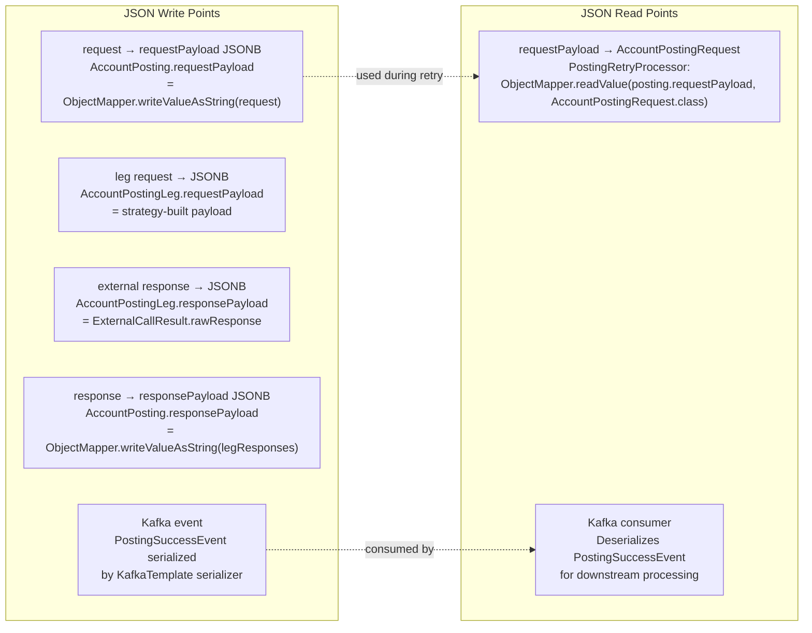
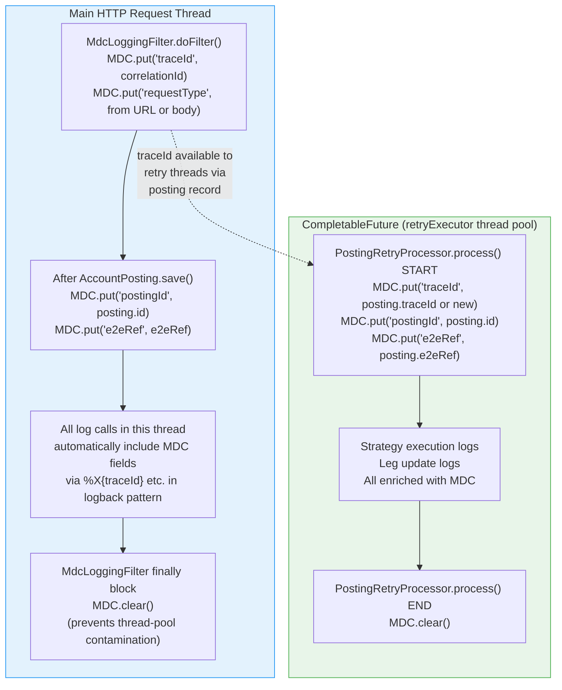
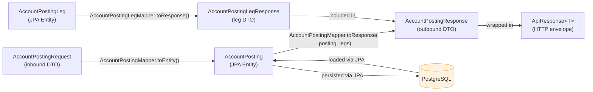

# Data Flow Diagram

Shows how data transforms as it travels through the system — from inbound HTTP request through entity persistence,
external system interaction, leg updates, response assembly, and MDC context propagation.

---

## Create Posting — Full Data Transformation Pipeline

```mermaid
flowchart TD
    subgraph HTTP_IN["1. HTTP Inbound"]
        REQ_JSON["HTTP Request Body\n{\n  endToEndReferenceId: 'E2E-001',\n  requestType: 'INTRA_BANK',\n  amount: 1000.00,\n  currency: 'USD',\n  debtorAccount: 'ACC-001',\n  creditorAccount: 'ACC-002',\n  ...\n}"]
    end

    subgraph MDC_LAYER["2. MDC Context (MdcLoggingFilter)"]
        MDC_SEED["MDC seeded:\ntraceId = X-Correlation-Id header\n(or generated UUID)\nAll log lines enriched automatically"]
    end

    subgraph DESER["3. Deserialization (Spring MVC)"]
        DTO_IN["AccountPostingRequest\n(Java object)\nJakarta Bean Validation applied\n@NotBlank, @NotNull, @Positive"]
    end

    subgraph IDEMPOTENCY["4. Idempotency Check"]
        DUP_CHECK["existsByEndToEndReferenceId()\n→ SELECT COUNT(*) WHERE e2e_ref = ?"]
    end

    subgraph CFG_LOAD["5. Config Load"]
        CFG["List&lt;PostingConfig&gt;\nfrom posting_config table\nordered by order_seq\n[{CBS, order=1}, {GL, order=2}]"]
    end

    subgraph ENTITY_CREATE["6. Entity Creation (MapStruct toEntity)"]
        ENTITY["AccountPosting @Entity\nstatus = PENDING\ncreatedAt = NOW()\nupdatedAt = NOW()"]
        JSON_SER1["requestPayload = ObjectMapper.writeValueAsString(request)\n→ JSONB stored in DB"]
    end

    subgraph MDC_ENRICH["7. MDC Enrichment (post-save)"]
        MDC2["MDC.put('postingId', posting.id)\nMDC.put('e2eRef', e2eRef)\nMDC.put('requestType', requestType)"]
    end

    subgraph LEG_PRE["8. Leg Pre-Insert (Loop 1)"]
        LEG_ENT["AccountPostingLeg @Entity\nstatus = PENDING\nmode = NORM\nattemptNumber = 1\nlegOrder = config.orderSeq\ntargetSystem = config.targetSystem"]
    end

    subgraph STRATEGY["9. Strategy Execution (Loop 2)"]
        STRAT_LOOKUP["PostingStrategyFactory\n.getStrategy('CBS_POSTING')\n→ CBSPostingService"]
        EXT_REQ["External Request built by strategy\n(CBS-specific format)\nstored as leg.requestPayload"]
        EXT_CALL["External System Stub\nCBSPostingService.callExternalSystem()\n→ ExternalCallResult {\n   success, referenceId, reason\n}"]
        LEG_UPDATE["UpdateLegRequest →\nleg.status = SUCCESS/FAILED\nleg.referenceId = 'CBS-REF-001'\nleg.postedTime = NOW()\nleg.responsePayload = raw JSON\nleg.attemptNumber = 1"]
    end

    subgraph STATUS_EVAL["10. Final Status Computation"]
        EVAL["allLegsSuccess() ?\n→ SUCCESS\nany FAILED/PENDING ?\n→ PENDING"]
    end

    subgraph RESPONSE_BUILD["11. Response Serialization"]
        RESP_PAYLOAD["responsePayload = ObjectMapper.writeValueAsString(legs)\n→ JSONB stored in DB"]
        MAPPER_OUT["AccountPostingMapper.toResponse(\n  posting, List&lt;LegResponse&gt;\n)\n→ AccountPostingResponse DTO"]
        ENV["ApiResponse.success(AccountPostingResponse)\n→ HTTP 200 JSON"]
    end

    subgraph KAFKA_PUB["12. Kafka Publish (if SUCCESS)"]
        EVT["PostingSuccessEvent record {\n  postingId, e2eRef, requestType,\n  timestamp\n}"]
        KAFKA_SEND["KafkaTemplate.send('posting.success', event)\n→ JSON serialized by Kafka serializer"]
    end

    REQ_JSON --> MDC_LAYER
    MDC_LAYER --> DESER
    DESER --> IDEMPOTENCY
    IDEMPOTENCY -- "not duplicate" --> CFG_LOAD
    CFG_LOAD --> ENTITY_CREATE
    ENTITY_CREATE --> MDC_ENRICH
    MDC_ENRICH --> LEG_PRE
    LEG_PRE --> STRATEGY
    STRATEGY --> STRAT_LOOKUP
    STRAT_LOOKUP --> EXT_REQ
    EXT_REQ --> EXT_CALL
    EXT_CALL --> LEG_UPDATE
    LEG_UPDATE --> STATUS_EVAL
    STATUS_EVAL --> RESPONSE_BUILD
    RESPONSE_BUILD --> RESP_PAYLOAD
    RESP_PAYLOAD --> MAPPER_OUT
    MAPPER_OUT --> ENV
    STATUS_EVAL -- "SUCCESS + kafka.enabled" --> KAFKA_PUB

    style HTTP_IN fill:#e3f2fd,stroke:#2196f3
    style MDC_LAYER fill:#fff3e0,stroke:#ff9800
    style DESER fill:#e8f5e9,stroke:#4caf50
    style IDEMPOTENCY fill:#fce4ec,stroke:#e91e63
    style CFG_LOAD fill:#f3e5f5,stroke:#9c27b0
    style ENTITY_CREATE fill:#e8f5e9,stroke:#4caf50
    style MDC_ENRICH fill:#fff3e0,stroke:#ff9800
    style LEG_PRE fill:#e0f2f1,stroke:#009688
    style STRATEGY fill:#ede7f6,stroke:#673ab7
    style STATUS_EVAL fill:#fce4ec,stroke:#e91e63
    style RESPONSE_BUILD fill:#e3f2fd,stroke:#2196f3
    style KAFKA_PUB fill:#f1f8e9,stroke:#8bc34a
```

---

## JSON Serialization Points

---

## MDC Context Propagation

---

## Mapping Layers Summary

---

## Key Notes

| Serialization point                                            | Why it matters                                                                                                                                                                 |
|----------------------------------------------------------------|--------------------------------------------------------------------------------------------------------------------------------------------------------------------------------|
| `AccountPosting.requestPayload` (JSONB)                        | The retry processor reads this to reconstruct the full `AccountPostingRequest` without needing the original HTTP request                                                       |
| `AccountPostingLeg.requestPayload` / `responsePayload` (JSONB) | Full audit trail of exactly what was sent to and received from each external system                                                                                            |
| `AccountPosting.responsePayload` (JSONB)                       | Stores the aggregated response after all legs complete — queryable from the UI                                                                                                 |
| **MDC thread isolation**                                       | Because `retryExecutor` uses a thread pool, MDC context is **not** inherited. `PostingRetryProcessor` explicitly seeds MDC at the start of each task and clears it at the end. |
| **MapStruct at compile time**                                  | All mapping code is generated at build time. Zero reflection overhead. Mapping errors surface as compilation failures, not runtime exceptions.                                 |
