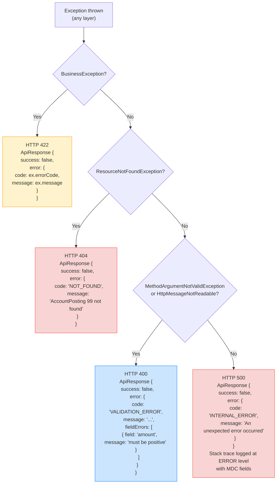
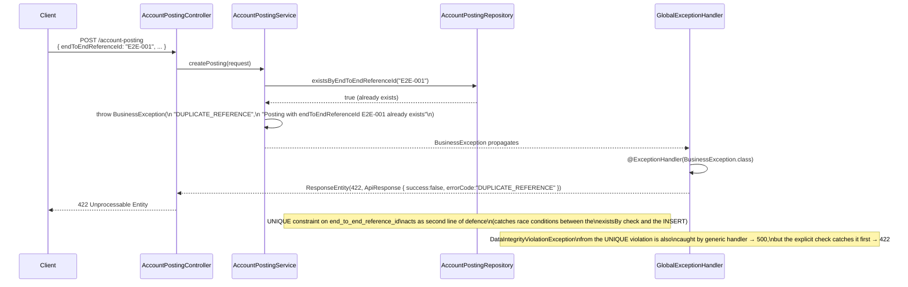
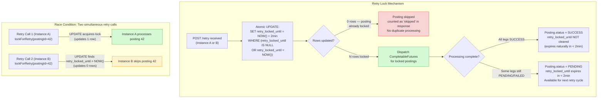
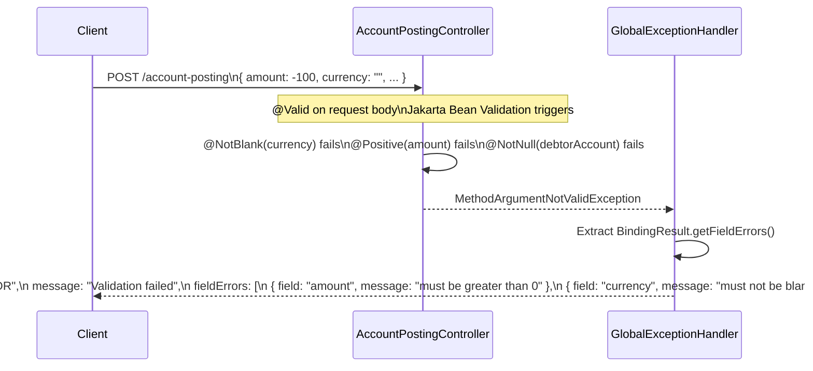

# Error Handling Flow

Shows how exceptions are caught and translated, what happens when external systems fail, how duplicate submissions are
handled, and how the retry lock expiry path works.

---

## Exception Hierarchy and HTTP Mapping

```mermaid
classDiagram
    class RuntimeException {
        <<Java>>
    }

    class BusinessException {
        -String errorCode
        -String message
        +BusinessException(String errorCode, String message)
        note "→ HTTP 422 Unprocessable Entity"
    }

    class ResourceNotFoundException {
        -String resourceName
        -Long resourceId
        +ResourceNotFoundException(String resource, Long id)
        note "→ HTTP 404 Not Found"
    }

    class MethodArgumentNotValidException {
        <<Spring MVC>>
        note "→ HTTP 400 Bad Request\n(Jakarta Bean Validation failures)"
    }

    class HttpMessageNotReadableException {
        <<Spring MVC>>
        note "→ HTTP 400 Bad Request\n(Malformed JSON body)"
    }

    class Exception {
        <<Java>>
        note "→ HTTP 500 Internal Server Error\n(all unhandled exceptions)"
    }

    class GlobalExceptionHandler {
        <<@RestControllerAdvice>>
        +handleBusinessException(BusinessException) ApiResponse
        +handleResourceNotFound(ResourceNotFoundException) ApiResponse
        +handleValidation(MethodArgumentNotValidException) ApiResponse
        +handleBadRequest(HttpMessageNotReadableException) ApiResponse
        +handleGeneric(Exception) ApiResponse
    }

    RuntimeException <|-- BusinessException
    RuntimeException <|-- ResourceNotFoundException
    GlobalExceptionHandler ..> BusinessException : @ExceptionHandler
    GlobalExceptionHandler ..> ResourceNotFoundException : @ExceptionHandler
    GlobalExceptionHandler ..> MethodArgumentNotValidException : @ExceptionHandler
    GlobalExceptionHandler ..> HttpMessageNotReadableException : @ExceptionHandler
    GlobalExceptionHandler ..> Exception : @ExceptionHandler
```

---

## GlobalExceptionHandler Response Mapping

---

## Duplicate endToEndReferenceId Handling

---

## External System Failure Path

```mermaid
flowchart TD
    subgraph Create_Flow["During Create Flow (Loop 2)"]
        CALL["Strategy calls External System\nCBSPostingService.callExternalSystem()"]
        CALL --> EXT_FAIL{External system\nresponse?}

        EXT_FAIL -- "SUCCESS\nExternalCallResult.success=true" --> LEG_SUCCESS["leg.status = SUCCESS\nleg.referenceId = CBS-REF-001\nleg.postedTime = NOW()"]

        EXT_FAIL -- "FAILED\nExternalCallResult.success=false" --> LEG_FAILED["leg.status = FAILED\nleg.reason = 'Timeout / error message'\nleg.responsePayload = raw error"]

        EXT_FAIL -- "Exception thrown\n(unchecked)" --> CATCH["Strategy catches exception\nLogs error with MDC\nReturns ExternalCallResult { success=false }"]
        CATCH --> LEG_FAILED

        LEG_SUCCESS --> NEXT_LEG["Proceed to next leg\n(Loop 2 continues regardless)"]
        LEG_FAILED --> NEXT_LEG

        NEXT_LEG --> ALL_DONE["All legs processed"]
        ALL_DONE --> EVAL{All legs SUCCESS?}

        EVAL -- "Yes" --> POST_SUCCESS["AccountPosting.status = SUCCESS\nPublish PostingSuccessEvent"]
        EVAL -- "No (any FAILED or PENDING)" --> POST_PENDING["AccountPosting.status = PENDING\n(eligible for retry)"]
    end

    subgraph Retry_Flow["During Retry Flow"]
        RETRY_CALL["PostingRetryProcessor\nStrategy calls External System again"]
        RETRY_CALL --> RETRY_RESULT{Result?}

        RETRY_RESULT -- "SUCCESS" --> RETRY_LEG_SUCCESS["leg.status = SUCCESS\nleg.mode = RETRY\nleg.attemptNumber++\nleg.postedTime = NOW()"]

        RETRY_RESULT -- "FAILED or Exception" --> RETRY_LEG_FAILED["leg.status = FAILED\nleg.mode = RETRY\nleg.attemptNumber++\nleg.reason updated"]

        RETRY_LEG_SUCCESS --> RETRY_EVAL{All legs SUCCESS?}
        RETRY_LEG_FAILED --> RETRY_EVAL

        RETRY_EVAL -- "Yes" --> RETRY_POST_SUCCESS["AccountPosting.status = SUCCESS\nPublish PostingSuccessEvent\nretry_locked_until expires naturally"]
        RETRY_EVAL -- "No" --> RETRY_POST_PENDING["AccountPosting.status = PENDING\nretry_locked_until expires in ~2min\nPosting available for next retry"]
    end

    style LEG_SUCCESS fill:#d4f9d4,stroke:#4caf50
    style LEG_FAILED fill:#f9d4d4,stroke:#f44336
    style POST_SUCCESS fill:#d4f9d4,stroke:#4caf50
    style POST_PENDING fill:#fff3cd,stroke:#ff9800
    style RETRY_LEG_SUCCESS fill:#d4f9d4,stroke:#4caf50
    style RETRY_LEG_FAILED fill:#f9d4d4,stroke:#f44336
    style RETRY_POST_SUCCESS fill:#d4f9d4,stroke:#4caf50
    style RETRY_POST_PENDING fill:#fff3cd,stroke:#ff9800
```

---

## Retry Lock Expiry and Race Condition Prevention

---

## Validation Error Flow

---

## Error Handling Summary Table

| Scenario                         | Exception                                                       | HTTP Status                   | Error Code            | Leg Effect       | Posting Effect                |
|----------------------------------|-----------------------------------------------------------------|-------------------------------|-----------------------|------------------|-------------------------------|
| Duplicate `endToEndReferenceId`  | `BusinessException`                                             | 422                           | `DUPLICATE_REFERENCE` | None created     | None created                  |
| Request field validation failure | `MethodArgumentNotValidException`                               | 400                           | `VALIDATION_ERROR`    | None created     | None created                  |
| Malformed JSON body              | `HttpMessageNotReadableException`                               | 400                           | `BAD_REQUEST`         | None created     | None created                  |
| Posting not found by ID          | `ResourceNotFoundException`                                     | 404                           | `NOT_FOUND`           | No change        | No change                     |
| External system returns failure  | Caught in strategy, returns `ExternalCallResult{success=false}` | 200 (normal flow continues)   | N/A                   | `status=FAILED`  | `status=PENDING`              |
| External system throws exception | Caught in strategy, logged, treated as failure                  | 200 (normal flow continues)   | N/A                   | `status=FAILED`  | `status=PENDING`              |
| All legs succeed                 | No exception                                                    | 200                           | N/A                   | `status=SUCCESS` | `status=SUCCESS`              |
| Retry — posting already locked   | No exception, skipped                                           | 200                           | N/A                   | No change        | No change                     |
| Kafka publish failure            | Logged at ERROR, not rethrown                                   | 200 (posting already SUCCESS) | N/A                   | No change        | Remains SUCCESS               |
| Unhandled runtime exception      | `Exception`                                                     | 500                           | `INTERNAL_ERROR`      | Varies           | Varies (transaction rollback) |

---

## Key Notes

| Design Decision                          | Rationale                                                                                                                                                                                                                                                                                            |
|------------------------------------------|------------------------------------------------------------------------------------------------------------------------------------------------------------------------------------------------------------------------------------------------------------------------------------------------------|
| **Strategy catches external exceptions** | External system failures must not propagate up and roll back the entire transaction. The strategy catches all exceptions, logs them, and returns a `FAILED` result so the posting stays `PENDING` for retry.                                                                                         |
| **Loop 2 continues after failure**       | All legs are attempted regardless of whether a previous leg failed. This ensures the maximum number of legs are processed in each invocation.                                                                                                                                                        |
| **UNIQUE DB constraint as backup**       | Even if the `existsByEndToEndReferenceId` check passes in a race condition (two simultaneous requests), the DB UNIQUE constraint on `end_to_end_reference_id` guarantees only one INSERT succeeds. The resulting `DataIntegrityViolationException` should be caught and mapped to 422 in production. |
| **Kafka failure non-blocking**           | A Kafka publish failure after a SUCCESS posting should not roll back the posting. Log at ERROR and alert ops, but the posting data is already safely in PostgreSQL.                                                                                                                                  |
| **Transaction scope**                    | `AccountPostingServiceImpl` methods are `@Transactional`. If an unhandled exception bubbles up, the entire create/update rolls back. Pre-inserted legs are also rolled back in this case — a clean state.                                                                                            |
